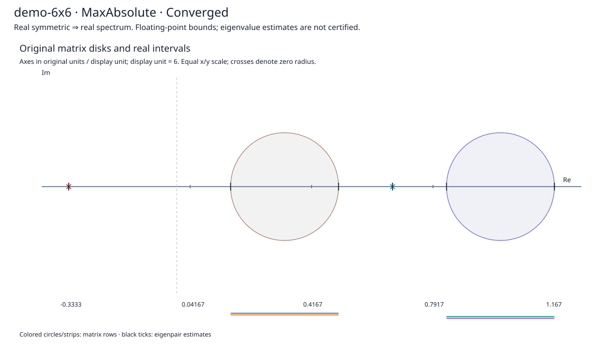
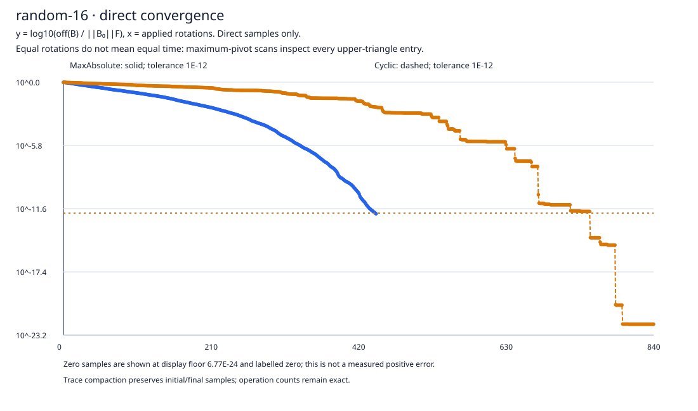
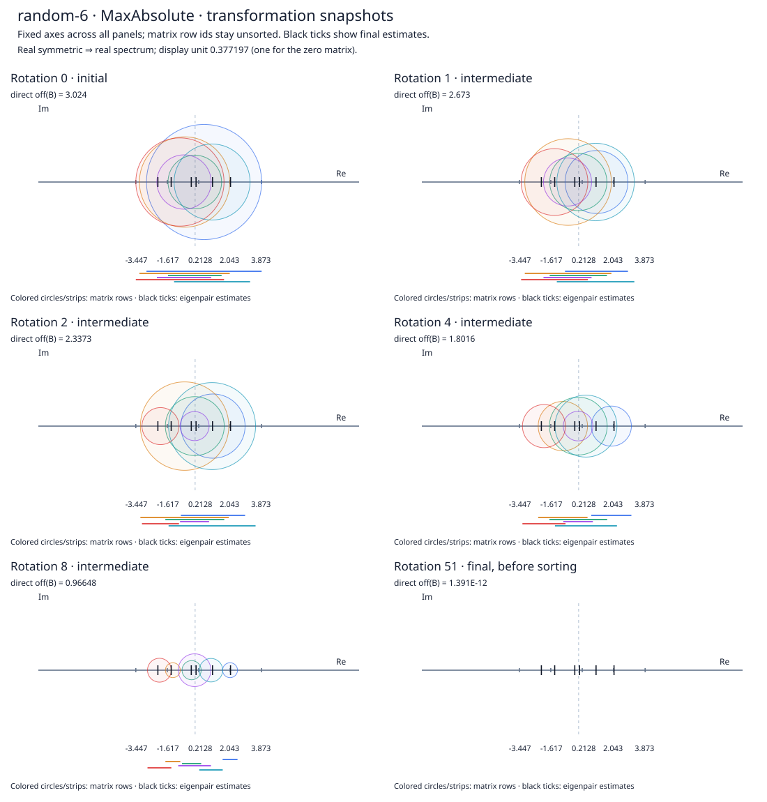

# gershgorin-jacobi-spectrum

A .NET 10 educational CLI for **Gershgorin spectral bounds** and **symmetric Jacobi eigensolvers**. It implements the numerical algorithms directly, with no production numerical or plotting dependencies.

The MVP is complete: maximum-absolute and cyclic pivots, eigenvectors, five deterministic matrix families, original-matrix accuracy diagnostics, JSON/CSV/SVG reports, and separate benchmark runs. Local Release verification passes **99 tests** and **40 example runs**. [Validation evidence](docs/VALIDATION.md) records measured errors and limits; Docker, remote CI and other architectures remain unverified.

## Quick start

Requires a stable .NET 10 SDK. Run from the repository root:

```powershell
dotnet restore GershgorinJacobiSpectrum.slnx --locked-mode
dotnet run --project src/Spectrum.Cli -c Release -- help
dotnet run --project src/Spectrum.Cli -c Release -- demo --out artifacts/demo
dotnet run --project src/Spectrum.Cli -c Release -- solve --family toeplitz --size 32 --pivot cyclic --out artifacts/toeplitz
dotnet run --project src/Spectrum.Cli -c Release -- solve --input examples/demo-6x6.json --out artifacts/input
dotnet run --project src/Spectrum.Cli -c Release -- compare --sizes '4,8,16' --repetitions 2 --out artifacts/comparison
```

Add `--overwrite` to reuse a nonempty output directory. Only generated files are replaced; unrelated files are preserved. The default seed is 42. Families are `dominant`, `toeplitz`, `clustered`, `near-diagonal`, and `random`. Orders above 512 require `--allow-large`; dense maximum-pivot runs can become expensive well before that.

Each solve writes a numerical summary, eigenpair residuals, disk bounds, a direct convergence trace, and SVG reports. Demos and input solves also export the matrix and eigenvectors for replay. Demo/comparison folders contain `index.md` with report links. See the [CLI reference](docs/CLI.md) and [output schema](docs/OUTPUTS.md).

## Charts from the application

### Spectral regions before solving

The analytic 6×6 demonstration has reference eigenvalues −2, 1, 3, 4, 5, 7. Colored disks and interval strips describe the original matrix; black ticks show the final eigenvalue estimates. Overlapping disks do not assign one eigenvalue to each row. Crosses represent zero-radius disks.



### Maximum-absolute versus cyclic pivots

Both strategies solve the same random symmetric 16×16 matrix with seed 42. The chart shows the directly computed relative off-diagonal norm versus applied rotations. Maximum pivots pay for a full upper-triangle search at every rotation, so fewer rotations do not automatically mean less elapsed time. A smaller transformed off-norm alone does not establish a more accurate eigensystem; original-matrix residuals are reported separately.



### How rotations change the disks

For a random 6×6 matrix with seed 42, these maximum-pivot snapshots share fixed coordinate limits. The final eigenvalue estimates appear in every panel. Individual disks and union widths need not shrink monotonically, even though each exact Jacobi rotation reduces squared off-diagonal mass.



The charts are SVG output stored in `docs/images/`, with no timestamps or timing measurements. [Chart provenance and regeneration](docs/images/README.md) describes the inputs. Refresh them with:

```powershell
pwsh -NoProfile -ExecutionPolicy Bypass -File scripts/update-readme-charts.ps1
```

## Numerical conventions

Input is finite and exactly symmetric; no hidden repair occurs, and the solver preserves caller data. Both strategies share a stable scaled rotation kernel and accumulate eigenvectors. Convergence requires a direct off-diagonal norm check, with defaults `rtol=1e-12`, `atol=0`.

Results distinguish convergence, rotation/sweep limits, stagnation, cancellation and numerical failure. Eigenvalues and corresponding eigenvector columns are sorted together. Eigenvector signs use a deterministic display convention; repeated eigenspaces do not have a unique basis.

Original-matrix residuals, reconstruction, orthogonality, invariant drift and containment accompany finite eigenpairs. Floating-point radius estimates and outward scalar bounds are separate; neither numerical containment nor the displayed eigenvalues constitute a certified eigendecomposition.

Scaling underflow is counted. Unrepresentable eigenvalues produce `NumericFailure`; optional unrepresentable diagnostics are null with warnings. Extreme dynamic ranges can lose relative accuracy for tiny eigenvalues. SVG axes use a labelled display unit and equal x/y scaling.

## Verification and timing

```powershell
pwsh -NoProfile -ExecutionPolicy Bypass -File scripts/verify.ps1
```

The process-only policy override supports Windows installations that block unsigned scripts. Verification performs locked restore, Release build/tests, both demo strategies, both Toeplitz strategies, diagonal/zero cases, a small comparison and repeated-run artifact validation. `artifacts/validation-evidence.json` records maxima and file counts. On Linux, run `bash scripts/verify.sh`; culture, reproducibility and export checks also run in the test suite. [Docker instructions](docs/DOCKER.md) are available.

The `compare` command keeps traced educational runs separate from untraced timed repetitions. It alternates policy order after warmups and reports raw timing samples plus median/min/max. Generation, diagnostics and rendering are outside solver timing; cloning and eigenvector allocation are inside. Timing has no CI pass threshold.

Deterministic fields repeat within a fixed runtime/arithmetic environment, excluding timing and environment metadata. Bit-identical numerical results across CPU architectures are not promised, especially for trigonometric fixtures.

## Documentation

| Guide | Contents |
|---|---|
| [Numerics](docs/NUMERICS.md) | Rotation convention, convergence, scaling and enclosure mathematics |
| [Core API](docs/CONTRACTS.md) | Types, ownership, options and stopping states |
| [Fixtures](docs/FIXTURES.md) | Matrix families, seeds and analytical references |
| [CLI](docs/CLI.md) | Commands, parameters, input format and exit codes |
| [Outputs](docs/OUTPUTS.md) | JSON/CSV schemas and SVG interpretation |
| [Performance](docs/PERFORMANCE.md) | Complexity, measurement protocol and memory estimates |
| [Testing](docs/TEST_PLAN.md) | Automated coverage and numerical acceptance ceilings |
| [Validation](docs/VALIDATION.md) | Executed checks, measured maxima and unexecuted environments |
| [Design decisions](docs/DECISIONS.md) | Implementation choices and numerical tradeoffs |
| [Source map](docs/REPOSITORY_MAP.md) | Core, CLI, tests and scripts |
| [References](docs/REFERENCES.md) | Background reading |
